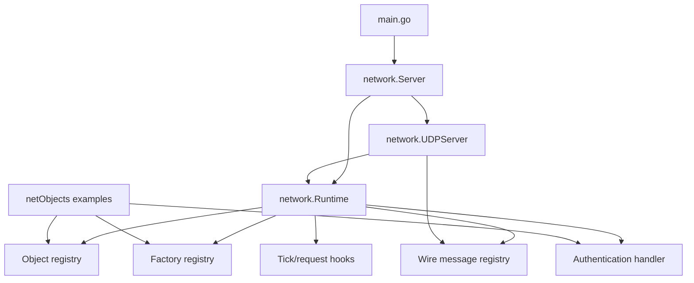
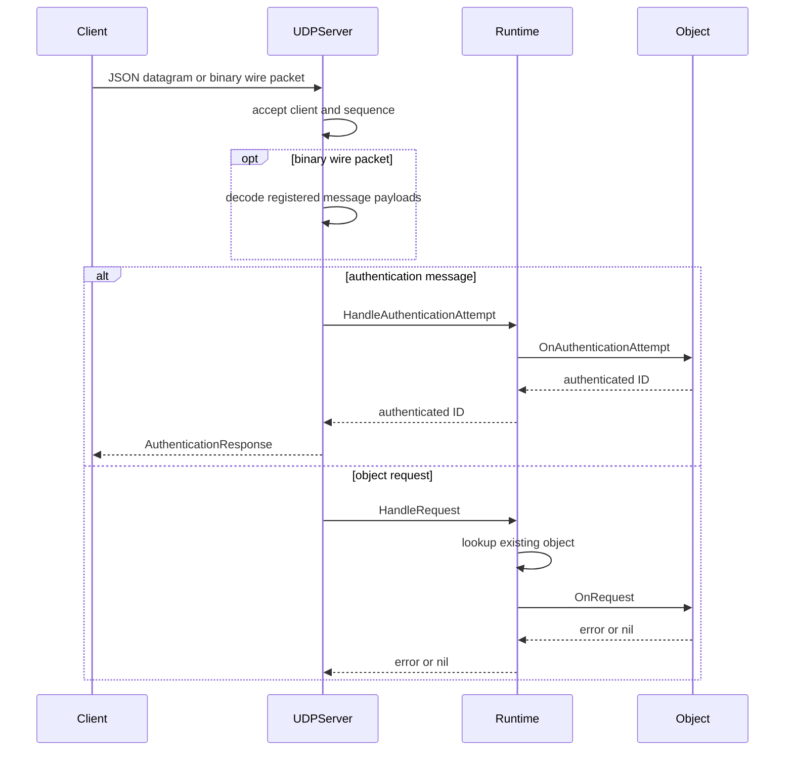
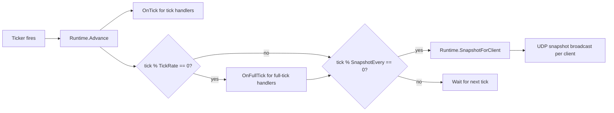

# Architecture

Enserva is organized around a small authoritative runtime. The runtime owns object identity, object lifecycle, request routing, ticks, and snapshots. The UDP server is a transport adapter around that runtime.

## Package Layout

```text
Enserva/
|-- main.go                    # Example UDP host and CLI flags
|-- network/
|   |-- protocol.go            # Config, interfaces, message/context types
|   |-- payload.go             # Request payload decoding helpers
|   |-- interest_management.go # Snapshot interest management feature
|   |-- runtime.go             # Runtime registry, hooks, auth, snapshots
|   |-- server.go              # Server facade
|   |-- udp.go                 # UDP transport
|   |-- wire.go                # Binary packet format and built-in codecs
|   |-- wire_registry.go       # Wire message registry and dispatch
|   `-- debug.go               # Debug JSON API and HTTP handler
|-- debugFrontend/             # Embedded browser debug interface
|-- netObjects/
|   |-- player.go              # Sample player and authenticator
|   |-- building.go            # Sample building object
|   `-- register.go            # Sample package registration helper
`-- tests/                     # Runtime, transport, auth, and wire tests
```

## Component Model



## Execution Flow

1. Application code creates a `network.Server`.
2. Application code registers objects, factories, and optional wire messages.
3. Optional authentication object is registered.
4. `ListenAndServe` starts the UDP listener.
5. A goroutine advances runtime ticks at `Config.TickInterval()`.
6. UDP datagrams are decoded as legacy JSON requests or binary wire packets.
7. Authentication messages go to the authentication object.
8. Regular object requests route to existing objects by `objectType` and `objectId`.
9. Snapshots are broadcast every `Config.SnapshotEvery()` ticks.

## Request Routing



!!! important
Client requests never call factories. A request must target an object that already exists in the runtime registry.

## Tick and Snapshot Flow



## Object Identity

Objects are addressed by `(ObjectType, ObjectID)`. The runtime trims whitespace and rejects empty values. Object replacement is allowed through `RegisterObject`. Controlled creation through `CreateObject` rejects duplicates.

## Authentication Model

Authentication is implemented by a normal object that also implements `AuthenticationHandler`. The runtime allows exactly one authentication object at a time.

When authentication is required:

- UDP auth messages are routed to the authentication object.
- The handler returns the authenticated client ID.
- The UDP client is marked authenticated under that ID.
- Regular requests from unauthenticated clients are rejected.
- Snapshot broadcasts skip unauthenticated clients.

## Binary Wire Model

Binary UDP packets start with the `ES` magic value and protocol version, then carry sequence, ack, ack bitset, payload length, and one or more framed messages. The runtime owns a `WireMessageRegistry` with built-in protocol and engine messages. Applications can register game messages in the `0x1000-0xffff` range before starting the transport.

Decoded wire messages can take three paths:

- Registered messages with handlers dispatch through `WireMessageRegistry.Dispatch`.
- Built-in compatibility messages such as `ObjectRequest` and `PlayerInput` are adapted into normal runtime requests.
- Unknown message IDs decode as `UnknownWireMessage` and are skipped by the UDP transport.

## Concurrency Model

`Runtime` uses two locks:

| Lock      | Purpose                                                                                                  |
| --------- | -------------------------------------------------------------------------------------------------------- |
| `mu`      | Protects tick value, object registry, factory registry, wire registry pointer, and authentication fields. |
| `hooksMu` | Serializes hook execution for `Advance`, `HandleRequest`, `HandleAuthenticationAttempt`, and `Snapshot`. |

The UDP server also has its own mutex for the client map and transport counters.

!!! note
Hook serialization means object callbacks are not called concurrently by the runtime. Object code can still call back into runtime methods, but long-running hooks will delay ticks, requests, authentication, and snapshots.

## Extension Points

Use these extension points for application behavior:

| Extension point                 | Use it for                                                |
| ------------------------------- | --------------------------------------------------------- |
| `network.Object`                | Defining authoritative server state.                      |
| `network.InitHandler`           | Registration-time setup such as feature registration.     |
| `network.RequestHandler`        | Handling client actions.                                  |
| `network.TickHandler`           | Movement, timers, physics steps, and per-tick simulation. |
| `network.FullTickHandler`       | Once-per-second counters and lower-frequency behavior.    |
| `network.AuthenticationHandler` | Mapping transport connections to application identities.  |
| `network.ObjectFactory`         | Server-controlled creation of objects by type and ID.     |
| `network.Features`              | Runtime-level opt-in features such as interest management. |
| `network.WireMessageRegistry`   | Custom binary message schemas and optional dispatch.       |
