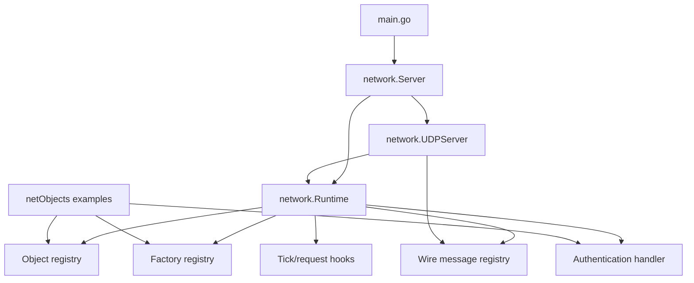
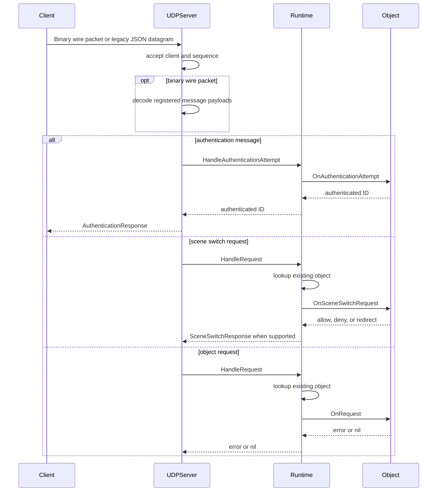
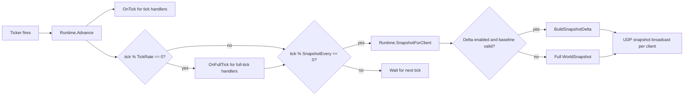

# Architecture

Enserva is organized around a small authoritative runtime. The runtime owns object identity, object lifecycle, request routing, ticks, and snapshots. The UDP server is a transport adapter around that runtime.

## Package Layout

```text
Enserva/
|-- main.go                    # Example UDP host and CLI flags
|-- network/
|   |-- protocol.go            # Config, interfaces, message/context types
|   |-- payload.go             # Request payload decoding helpers
|   |-- interest_management.go # Snapshot interest management feature
|   |-- scene_management.go    # Scene membership and filtering feature
|   |-- runtime.go             # Runtime registry, hooks, auth, snapshots
|   |-- server.go              # Server facade
|   |-- udp.go                 # UDP transport
|   |-- wire.go                # Binary packet format and built-in codecs
|   |-- wire_registry.go       # Wire message registry and dispatch
|   `-- debug.go               # Debug JSON API and HTTP handler
|-- debugFrontend/             # Embedded browser debug interface
|-- netObjects/
|   |-- player.go              # Sample player and authenticator
|   |-- building.go            # Sample building object
|   `-- register.go            # Sample package registration helper
`-- tests/                     # Runtime, transport, auth, and wire tests
```

## Component Model



## Execution Flow

1. Application code creates a `network.Server`.
2. Application code registers objects, factories, and optional wire messages.
3. Optional authentication object is registered.
4. `ListenAndServe` starts the UDP listener.
5. A goroutine advances runtime ticks at `Config.TickInterval()`.
6. UDP datagrams are decoded as binary wire packets first when they carry the `ES` magic value; legacy JSON requests remain a compatibility path.
7. Authentication messages go to the authentication object.
8. Regular object requests route to existing objects by `objectType` and `objectId`.
9. Reliable wire messages are deduplicated, ordered when requested, and tracked for retries when sent.
10. Tick-aligned client inputs are validated against the configured past/future windows and buffered by client ID and target tick.
11. Immediate responses and snapshots are serialized as wire or JSON payloads and checked against `Config.MaxUDPPacketSize` before `WriteToUDP`.
12. Snapshots are broadcast every `Config.SnapshotEvery()` ticks.

## Request Routing



!!! important
Client requests never call factories. A request must target an object that already exists in the runtime registry.

## Tick and Snapshot Flow



Full snapshots remain the default. When `Config.EnableDeltaSnapshots` is true, UDP keeps a per-client baseline of the previously sent visible snapshot. Deltas are computed from already-filtered snapshots, so snapshot visibility, scene membership, and interest management are applied before diffing. A full snapshot is forced when a client has no baseline, when the configured `FullSnapshotInterval` cycle expires, after authentication changes a client identity, after scene-switch handling, after a client changes protocol mode, or after a disconnected client reconnects.

## Object Identity

Objects are addressed by `(ObjectType, ObjectID)`. The runtime trims whitespace and rejects empty values. Object replacement is allowed through `RegisterObject`. Controlled creation through `CreateObject` rejects duplicates.

## Authentication Model

Authentication is implemented by a normal object that also implements `AuthenticationHandler`. The runtime allows exactly one authentication object at a time.

When authentication is required:

- UDP auth messages are routed to the authentication object.
- The handler returns the authenticated client ID.
- The UDP client is marked authenticated under that ID.
- Regular requests from unauthenticated clients are rejected.
- Snapshot broadcasts skip unauthenticated clients.
- Outbound snapshot packets that exceed `Config.MaxUDPPacketSize` are dropped and counted by the UDP debug counters instead of relying on network fragmentation.

## Binary Wire Model

Binary UDP packets start with the `ES` magic value and protocol version, then carry sequence, ack, ack bitset, payload length, and one or more framed messages. The runtime owns a `WireMessageRegistry` with built-in protocol and engine messages. Applications can register game messages in the `0x1000-0xffff` range before starting the transport.

Decoded wire messages can take three paths:

- Registered messages with handlers dispatch through `WireMessageRegistry.Dispatch`.
- Built-in compatibility messages such as `ObjectRequest` and unticked legacy `PlayerInput` are adapted into normal runtime requests.
- Tick-aligned `GenericClientInput` and ticked `PlayerInput` messages are buffered for game code to consume through `Runtime.ConsumeClientInputs*`.
- Unknown message IDs decode as `UnknownWireMessage` and are skipped by the UDP transport.

Server snapshot output uses `WorldSnapshot` for full wire snapshots and `WorldDeltaSnapshot` for aggregate delta snapshots. Legacy JSON clients receive the equivalent `SnapshotMessage` and `DeltaSnapshotMessage` envelopes.

## Client Input Buffer Model

The runtime owns a generic per-client input buffer keyed by target tick. The buffer stores `ClientInput` envelopes containing client ID, input sequence, tick, optional object/target IDs, an opaque payload, and receipt time. It does not interpret payloads or apply movement, shooting, inventory, crafting, or other gameplay behavior.

`Config.MaxInputPastTicks` rejects stale input, `Config.MaxInputFutureTicks` rejects inputs too far ahead of the current runtime tick, and `Config.InputBufferLimit` caps retained inputs per client. Accepted inputs are sorted deterministically by tick, sequence, object type, object ID, and target ID. Game code typically consumes inputs during `OnTick` with `Runtime.ConsumeClientInputs`, `ConsumeClientInputsForTick`, `ConsumeClientInputsForObject`, or `ConsumeClientInputsForObjectAtTick`.

Debug state exposes cumulative input-buffer metrics under `runtime.inputBuffer`: buffered, consumed, stale rejected, future rejected, and dropped.

## Reliable Delivery Model

Reliable delivery is an opt-in UDP wire feature layered over the existing packet sequence and ack fields. Unreliable remains the default delivery class, so snapshots and hot-path input continue using the original fire-and-forget behavior unless explicitly wrapped.

Reliable messages are encoded as a protocol envelope containing delivery class, reliable ID, inner message type, and inner payload. The UDP transport keeps outgoing reliable messages per client until a packet sequence that carried the message is acknowledged by the peer. Unacknowledged messages are retransmitted after `Config.ReliableRetryInterval` and dropped after `Config.ReliableMaxAttempts`; `Config.ReliableQueueLimit` bounds each client's pending queue.

Inbound reliable unordered messages dispatch once per reliable ID. Inbound reliable ordered messages buffer out-of-order IDs and release them to runtime dispatch only when all prior ordered IDs have arrived. Duplicate reliable IDs are suppressed before registry handlers or runtime request routing run.

The current reliable queue is transport-internal. It covers wire messages sent through UDP response handling and registry delivery metadata; it does not make legacy JSON or snapshots reliable by default.

## Concurrency Model

`Runtime` uses two locks:

| Lock      | Purpose                                                                                                  |
| --------- | -------------------------------------------------------------------------------------------------------- |
| `mu`      | Protects tick value, object registry, factory registry, wire registry pointer, and authentication fields. |
| `hooksMu` | Serializes hook execution for `Advance`, `HandleRequest`, `HandleAuthenticationAttempt`, and `Snapshot`. |

The UDP server also has its own mutex for the client map and transport counters.

!!! note
Hook serialization means object callbacks are not called concurrently by the runtime. Object code can still call back into runtime methods, but long-running hooks will delay ticks, requests, authentication, and snapshots.

## Outbound UDP Packet Size

`Config.MaxUDPPacketSize` bounds the serialized UDP payload sent by the built-in transport. The default is 1200 bytes, which is a conservative MTU-safe value for internet UDP traffic. The transport enforces the limit for both binary wire packets and legacy JSON packets after serialization and before `WriteToUDP`.

Oversized immediate responses return `ErrUDPPacketTooLarge` to the caller that attempted the response. Oversized snapshots are skipped for that client on that tick. Both cases increment the UDP debug counter for oversized outbound packet drops and write a log entry with the packet kind, destination, actual size, and configured limit.

## Extension Points

Use these extension points for application behavior:

| Extension point                 | Use it for                                                |
| ------------------------------- | --------------------------------------------------------- |
| `network.Object`                | Defining authoritative server state.                      |
| `network.InitHandler`           | Registration-time setup such as feature registration.     |
| `network.RequestHandler`        | Handling client actions.                                  |
| `network.TickHandler`           | Movement, timers, physics steps, and per-tick simulation. |
| `network.FullTickHandler`       | Once-per-second counters and lower-frequency behavior.    |
| `network.AuthenticationHandler` | Mapping transport connections to application identities.  |
| `network.SceneSwitchHandler`    | Validating and authorizing scene switch requests.         |
| `network.ObjectFactory`         | Server-controlled creation of objects by type and ID.     |
| `network.Features`              | Runtime-level opt-in features such as interest and scenes. |
| `network.WireMessageRegistry`   | Custom binary message schemas and optional dispatch.       |
