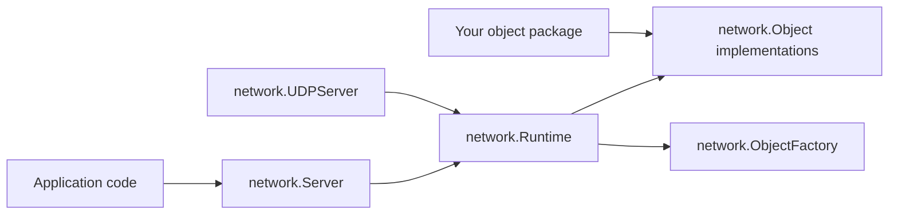

# Developer API

Enserva exposes one core API package and one example object package:

| Package                                   | Purpose                                                                                                                                          |
| ----------------------------------------- | ------------------------------------------------------------------------------------------------------------------------------------------------ |
| [`Enserva/network`](api/network.md)       | Core runtime, server, UDP transport, binary wire protocol, object interfaces, request/snapshot messages, and error values.                       |
| [`Enserva/netObjects`](api/netobjects.md) | Example object implementations. This package demonstrates how a user-owned object package can be structured. It is not the framework's core API. |

The README describes `netObjects` as an example package name. In your own app, create a normal Go package for authoritative objects, such as `netObjects`, `world`, `entities`, or `serverstate`, and implement the interfaces from `network`.

## Public API Shape



## Common Workflow

1. Create a `network.Config`.
2. Create a `network.Server`.
3. Register objects or factories.
4. Optionally register one authentication object.
5. Start the UDP server with `ListenAndServe`.

```go
config := network.DefaultConfig()
server := network.NewServer(config)

if err := server.RegisterFactory("player", network.ObjectFactoryFunc(netobjects.PlayerFactory)); err != nil {
	return err
}
if err := server.RegisterAuthenticationObject(netobjects.NewPlayerAuthenticator("default")); err != nil {
	return err
}

return server.ListenAndServe()
```

## Object Method Summary

These are the methods a network object can use. The first three are required because they make up `network.Object`. The rest are optional hooks detected by interface assertions at runtime.

| Method                                                                   | Required | Interface               | Called when                                                      |
| ------------------------------------------------------------------------ | -------- | ----------------------- | ---------------------------------------------------------------- |
| `ObjectType() string`                                                    | Yes      | `Object`                | Registration, lookup, request routing, and snapshots.            |
| `ObjectID() string`                                                      | Yes      | `Object`                | Registration, lookup, request routing, and snapshots.            |
| `Snapshot() any`                                                         | Yes      | `Object`                | Snapshot generation.                                             |
| `OnInit(network.InitContext)`                                            | No       | `InitHandler`           | Immediately after the object is registered.                      |
| `OnTick(network.TickContext)`                                            | No       | `TickHandler`           | Every runtime tick.                                              |
| `OnFullTick(network.TickContext)`                                        | No       | `FullTickHandler`       | Once per completed second of ticks.                              |
| `OnRequest(network.RequestContext) error`                                | No       | `RequestHandler`        | A request targets an existing object.                            |
| `OnAuthenticationAttempt(network.AuthenticationContext) (string, error)` | No       | `AuthenticationHandler` | A UDP message has `type: "auth"` or `type: "authentication"`.    |
| `SnapshotVisible() bool`                                                 | No       | `SnapshotVisibility`    | Snapshot generation. Return `false` to hide server-only objects. |

Factories are separate from objects:

| Method                                                         | Interface       | Called when                                                        |
| -------------------------------------------------------------- | --------------- | ------------------------------------------------------------------ |
| `CreateObject(network.RequestContext) (network.Object, error)` | `ObjectFactory` | Server code calls `Runtime.CreateObject` or `Server.CreateObject`. |

!!! note
Most package-level exported variables are error sentinels used with `errors.Is`. The package also exports wire protocol constants for packet versioning, message IDs, and message ID ranges.

## Package References

- [`network`](api/network.md)
- [`Wire Protocol`](api/wire-protocol.md)
- [`Implementing Objects`](api/netobjects.md)
